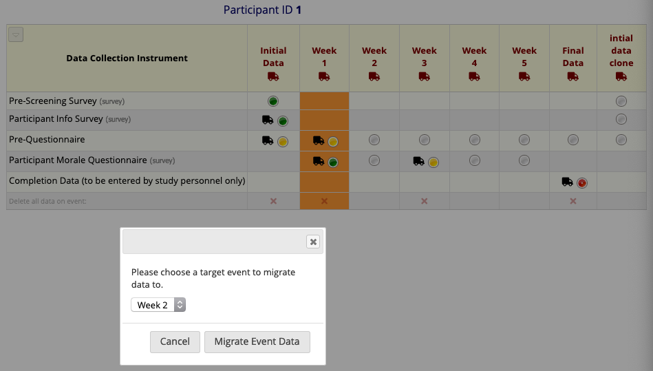
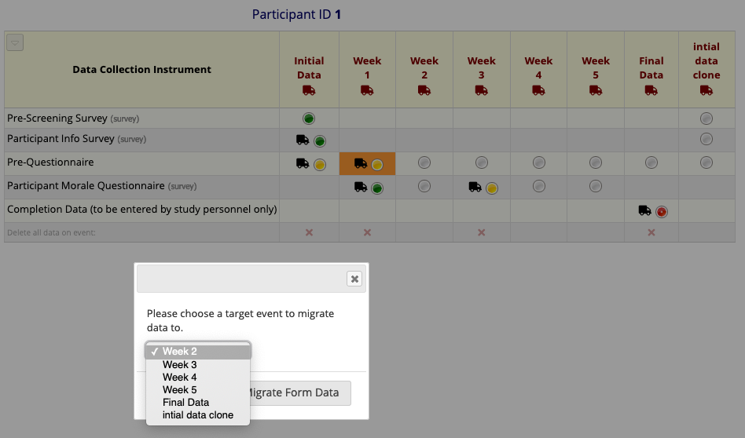

# Move Data to Other Event

Allow privileged users to easily move data, uploaded files and signatures between events.

## Prerequisites
 - REDcap >= 9.3.0

## Easy installation
- Install the _Move Data to Other Event_ module from the Consortium [REDCap Repo] (https://redcap.vanderbilt.edu/consortium/modules/index.php) from the Control Center.

## Manual Installation
- Clone this repo into to `<redcap-root>/modules/move_data_to_other_event_v0.0.0`.

## Introduction

When enabled, this module adds a set of controls to the Record Home Page to allow entire forms or entire events of data to be moved to another event. The controls appear on the Record Home Page as truck icons next to a form and beneath each event name. Clicking on a truck will present a menu of valid target events for the form or event selected.

## Global Configuration

- **Restrict use to designers globally**: Access may be limited globally to users with project design rights. By default, this module is **not** visible to all users. This is in place to allow administrators more control as a project-level option can grant non-designers access to this module's functionality.

## Project Configuration

- **Activate for use**: The module may be rendered active/inactive via a project-level configuration checkbox. This has the same effect as disabling the module, but allows a project designer to toggle the feature on and off even when they cannot enable/disable the module.
- **Allow non-designers to see and use this module**: You may allow non-designers to see the truck icons and use the module on a per-project basis. The global configuration setting, **Restrict use to designers globally**, _will override this option if it is selected_; administrators have the final say in who may use this module.

## Use

Moving truck icons will appear at the top of each event and beside any form which contains data (i.e. a non-gray circle icon).

Upon clicking an icon, a menu will appear showing the valid target events. The form cell or event column you are attempting to migrate will be highlighted. Migrations are only allowed to forms or events where no data is contained in the target forms.

Clicking a moving truck in the event title row will allow migration of data to other events, provided all forms in the source event are present in the target event **and** those target forms unfilled.

Moving truck icons may be presented on forms or events which have no valid targets, in this case they will still be clickable but the dropdown menu will be empty.
